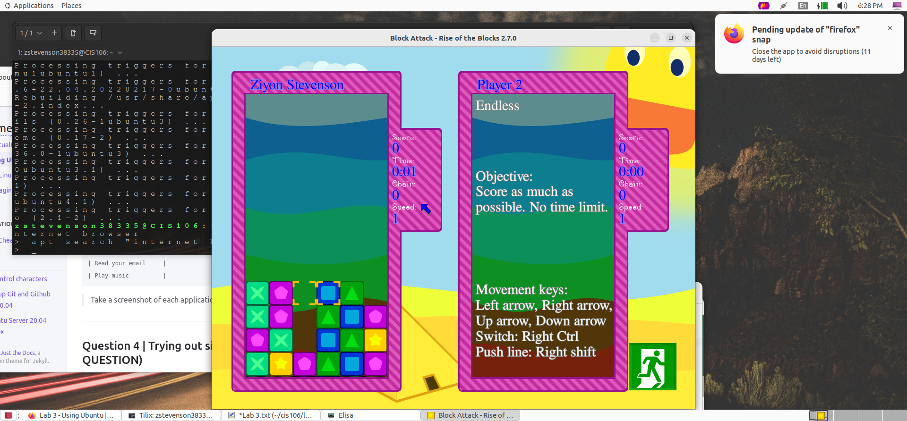
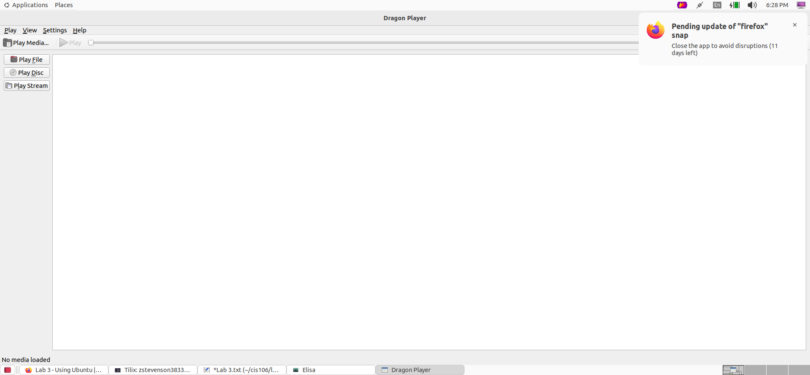
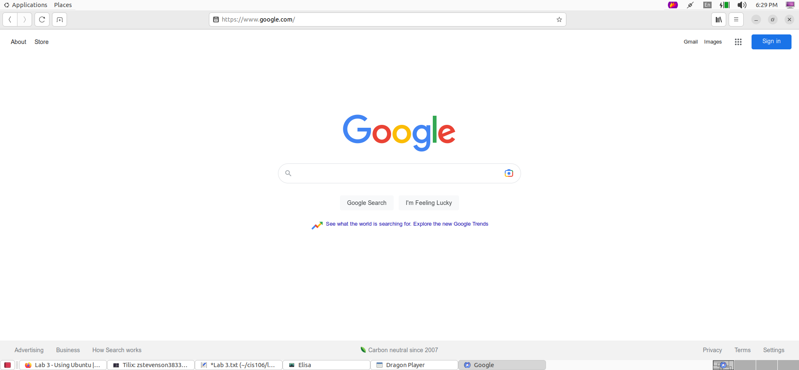
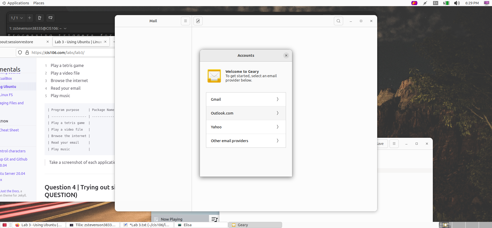
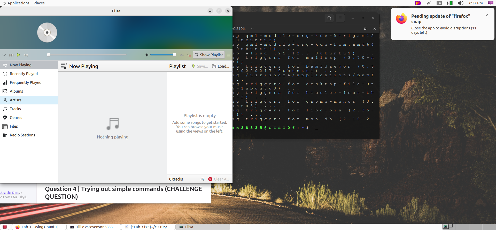

***
Name: Ziyon Stevenson
Semester: Spring 2023
Course: CIS 106 Linux Fundamentals
***

# Lab 3 Using Ubuntu

## Question 1

## Question 2

## Question 3
| Program purpose     | Package Name     | Version            |
| ------------------- | ---------------- | ------------------ |
| Play a tetris game  | blockattack      | 2.7.0-1            |
| Play a video file   | dragonplayer     | 4:21.12.3-0ubuntu1 |
| Browse the internet | epiphany-browser | 42.4-0ubuntu1      |
| Read your email     | geary            | 40.0-2             |
| Play music          | elisa            | 21.12.3-0ubuntu1   |

## Question 4
| command | what it does                                                                                                                                                                                                                          |
| ------- | ------------------------------------------------------------------------------------------------------------------------------------------------------------------------------------------------------------------------------------- |
| echo    | Echo the STRING(s) to standard output.                                                                                                                                                                                                |
| fortune | When  fortune  is  run  with no arguments it prints out a random  epigram.  Epigrams  are divided  into several categories, where each category is sub-divided into those which are potentially  offensive  and  those which are not. |
| cowsay  | Cowsay generates an ASCII picture of  a  cow saying  something  provided by the user.                                                                                                                                                 |
| lolcat  | This manual page documents briefly the  lolcat command.                                                                                                                                                                               |
| figlet  | Figlet  prints its input using large characters.                                                                                                                                                                                      |
| toilet  | Toilet  prints  text  using large characters made of smaller characters.                                                                                                                                                              |
| rig     | Rig  is a utility that will piece together a random first name, last name, street  number and  address,  along  with  a geographically consistant (ie,  they  all  match  the  same area) city, state, ZIP code, and area code.       |